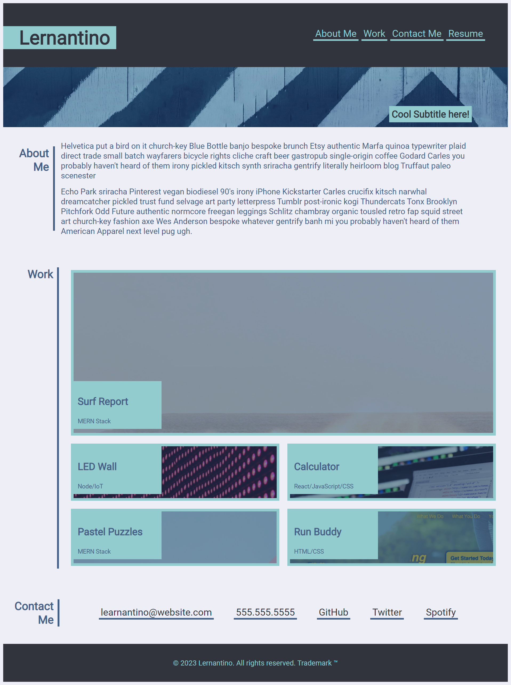

# CSS-Portfolio-Example

## Example portfolio page using HTML and CSS

This purpose of this project was to use different aspects of html, css, and advanced css in order to build an example portfolio project.

I was able to use some advance CSS properties like flexbox and grid to not only match the layout but to also behave responsively on different screen sizes

One particular property that I had never saw or used before this project was using the html selector in CSS to set up a smooth scrolling effect when internal navigation links are clicked. So this was a learning experience, for sure. 

## Installation

There is no installation requirement

## Usage
This project is deployed via GitHib pages. Follow this link to view: [Github Pages Deployed Site](https://joecode22.github.io/CSS-Portfolio-Ex) [1]: 

## Credits

I observered Leon from #100Devs use google fonts to obtain the Roboto font and I did something similar so I must give him credit. 

## License
please refer to the license section

## Features

Some key features of the styling include:

1. Custom color variables for easy color management.
2. Flexbox and grid layouts for responsive design.
3. Custom underline for navigation links and hover effects.
4. Custom styling for the header, main content sections, and footer.
5. Background images for specific project cards.
