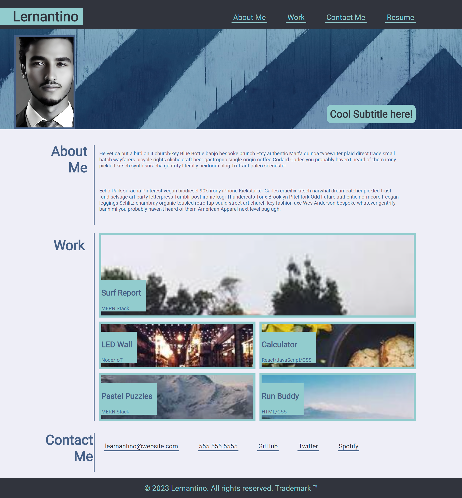

# Portfolio Page

## Portfolio page built with HTML and CSS

This purpose of this project was to use different aspects of html, css, and advanced css in order to build an example portfolio project

## Installation

There is no installation requirement

## Usage

This project is deployed via GitHib pages. Follow this link to view: [Github Pages Deployed Site](https://joecode22.github.io/CSS-Portfolio-Ex) [1]: 

## Credits
Photo by <a href="https://unsplash.com/@yogidan2012?utm_source=unsplash&utm_medium=referral&utm_content=creditCopyText">Daniele Levis Pelusi</a> on <a href="https://unsplash.com/photos/u1PsUccMa5g?utm_source=unsplash&utm_medium=referral&utm_content=creditCopyText">Unsplash</a>
  

## License

please refer to the license section

## Features

Some key features of the styling include:

1. Custom color variables for easy color management.
2. Flexbox and grid layouts for responsive design.
3. Custom underline for navigation links and hover effects.
4. Custom styling for the header, main content sections, and footer.
5. Background images for specific project cards and the subtitle section.
6. Photo/Avatar located within the subtitle section
